<!--
MIT License

Copyright (c) 2021 Othneil Drew

Permission is hereby granted, free of charge, to any person obtaining a copy
of this software and associated documentation files (the "Software"), to deal
in the Software without restriction, including without limitation the rights
to use, copy, modify, merge, publish, distribute, sublicense, and/or sell
copies of the Software, and to permit persons to whom the Software is
furnished to do so, subject to the following conditions:

The above copyright notice and this permission notice shall be included in all
copies or substantial portions of the Software.

THE SOFTWARE IS PROVIDED "AS IS", WITHOUT WARRANTY OF ANY KIND, EXPRESS OR
IMPLIED, INCLUDING BUT NOT LIMITED TO THE WARRANTIES OF MERCHANTABILITY,
FITNESS FOR A PARTICULAR PURPOSE AND NONINFRINGEMENT. IN NO EVENT SHALL THE
AUTHORS OR COPYRIGHT HOLDERS BE LIABLE FOR ANY CLAIM, DAMAGES OR OTHER
LIABILITY, WHETHER IN AN ACTION OF CONTRACT, TORT OR OTHERWISE, ARISING FROM,
OUT OF OR IN CONNECTION WITH THE SOFTWARE OR THE USE OR OTHER DEALINGS IN THE
SOFTWARE.

See: https://github.com/othneildrew/Best-README-Template/pull/73
-->
<a name="readme-top"></a>


<!-- PROJECT SHIELDS -->
[![Contributors][contributors-shield]][contributors-url]
[![Forks][forks-shield]][forks-url]
[![Stargazers][stars-shield]][stars-url]
[![Issues][issues-shield]][issues-url]
[![MIT License][license-shield]][license-url]


<!-- PROJECT LOGO -->
<br />
<div align="center">
  <a href="https://github.com/ROCCIA-901/roccia_901_client">
    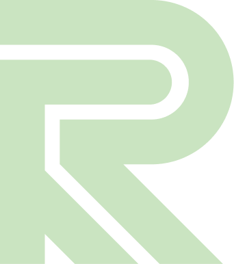
  </a>

<h3 align="center">ROCCIA 901 Client</h3>

  <p align="center">
    클라이밍 운동 기록 및 출석 관리 서비스 Web 및 PWA용 클라이언트
    <br />
    <br />
  </p>
</div>


<!-- TABLE OF CONTENTS -->
<h5>목차</h5>
<ol>
<li>
  <a href="#개요">개요</a>
  <ul>
    <li><a href="#기술-스택">기술 스택</a></li>
  </ul>
</li>
<li><a href="#화면-구성">화면 구성</a></li>
<li><a href="#빠른-시작">빠른 시작</a></li>
<li><a href="#라이센스">라이센스</a></li>
<li><a href="#contact">Contact</a></li>
</ol>
<br>


<!-- ABOUT THE PROJECT -->
## 개요
<div align="center">
    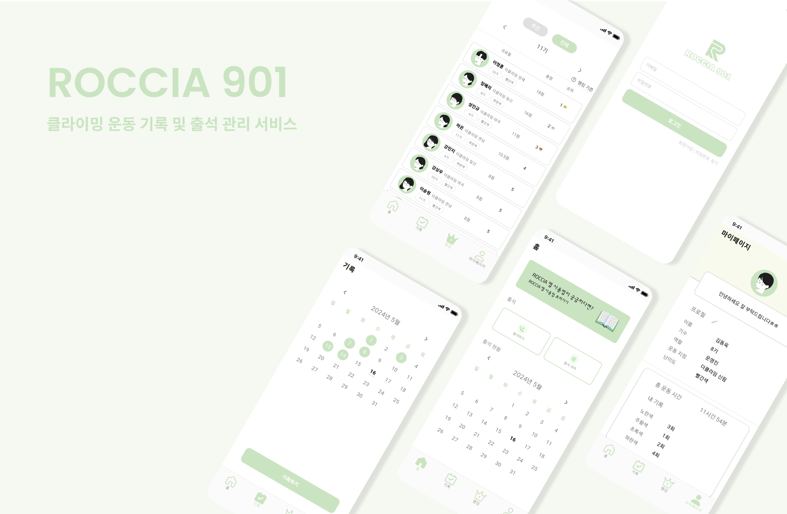
</div>

<br>
ROCCIA 901 동아리는 2019년에 처음 결성되어 지속되고 있는 클라이밍 대학 연합 동아리입니다.<br>
이 서비스는 ROCCIA 901 동아리 부원들을 위해 제작되었으며,
부원들의 출석 관리와 해결한 볼더링 문제를 일자별로 관리하는 등의 기능을 제공하여 부원들에게 편리함을 주고자 합니다.

### 기술 스택
&ensp;[![Dart][Dart.dev]][Dart-url]
&ensp;[![Flutter][Flutter.dev]][Flutter-url]

### 진행 기간
2024.01.15 ~ 

<p align="right">(<a href="#readme-top">back to top</a>)</p>


<!-- USAGE EXAMPLES -->
## 화면 구성
| 로그인 | 회원가입 | 비밀번호 찾기 |
|:---:|:---:|:---:|
| 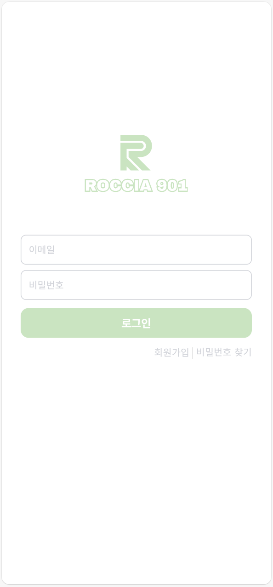 | 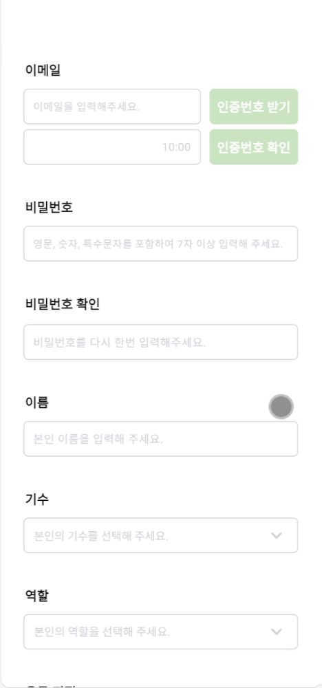 | 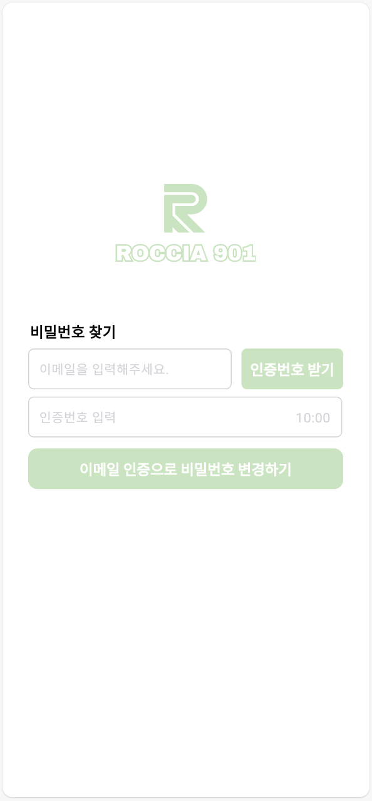 |

| 홈 | 랭킹 | 랭킹 프로필 |
|:---:|:---:|:---:|
| 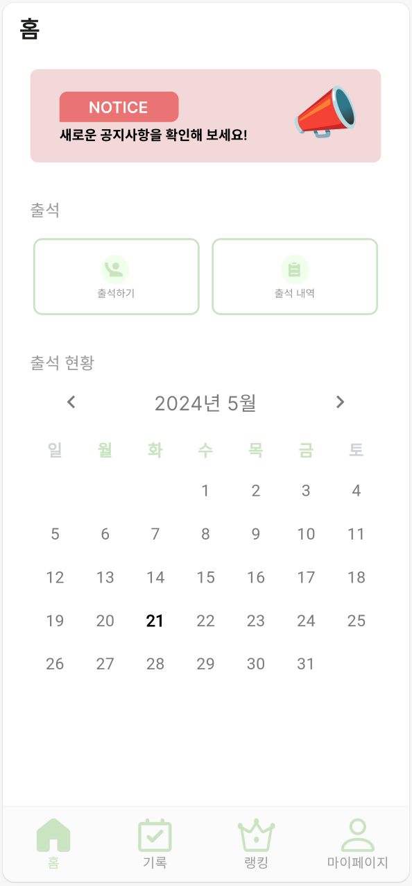 | 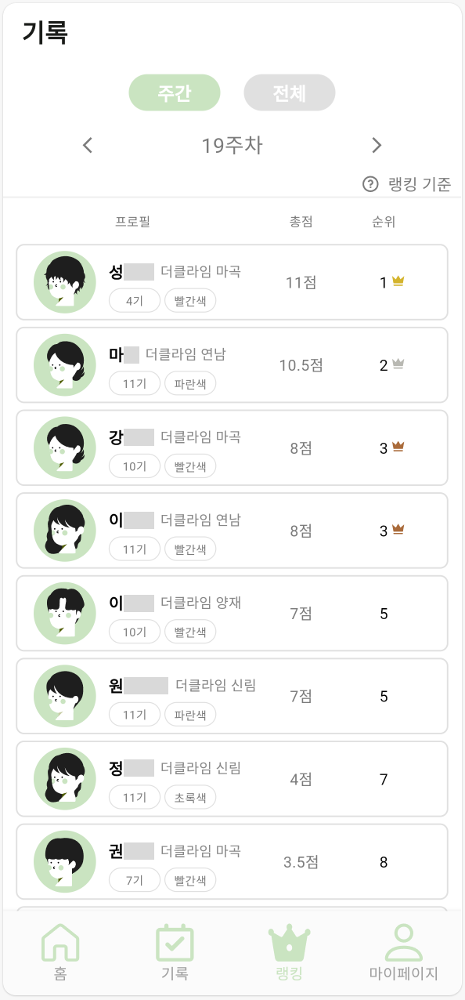 | 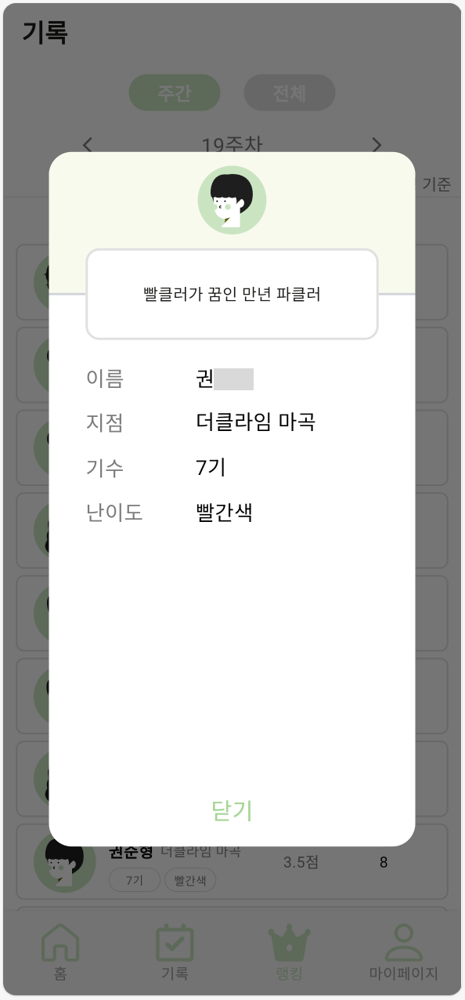 |

| 기록 | 기록 생성 | 기록 상세 |
|:---:|:---:|:---:|
| 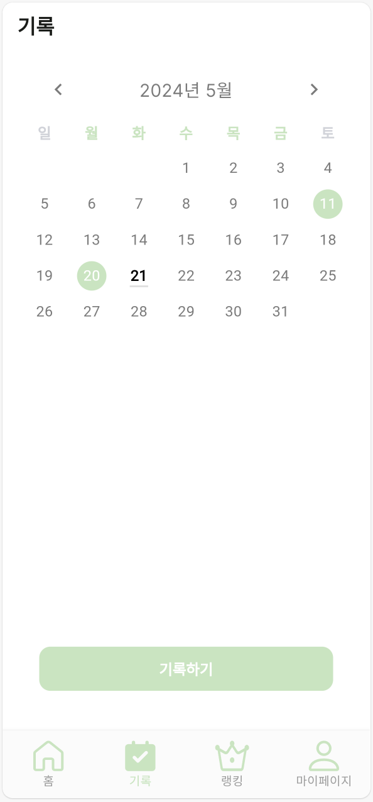 | 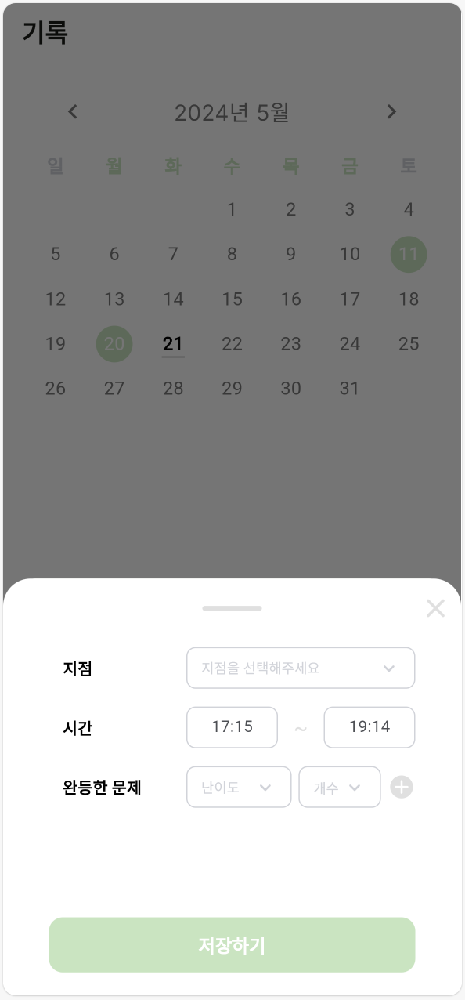 | 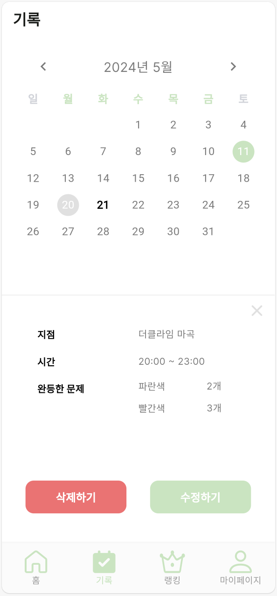 |

<p align="right">(<a href="#readme-top">back to top</a>)</p>

# 빠른 시작

### 요구 사항

- Docker & Docker Compose

### Nginx로 실행
```shell
docker compose up
```

<!-- LICENSE -->
## 라이센스

MIT 라이센스를 준수합니다. 자세한 내용은 `LICENSE`에서 확인할 수 있습니다.

<p align="right">(<a href="#readme-top">back to top</a>)</p>


<!-- CONTACT -->
## Contact

권순형 - soonvro@gmail.com

Project Link: [https://github.com/ROCCIA-901](https://github.com/ROCCIA-901)

<p align="right">(<a href="#readme-top">back to top</a>)</p>


<!-- MARKDOWN LINKS & IMAGES -->
<!-- https://www.markdownguide.org/basic-syntax/#reference-style-links -->
[contributors-shield]: https://img.shields.io/github/contributors/ROCCIA-901/roccia_901_client.svg?style=for-the-badge
[contributors-url]: https://github.com/ROCCIA-901/roccia_901_client/graphs/contributors
[forks-shield]: https://img.shields.io/github/forks/ROCCIA-901/roccia_901_client.svg?style=for-the-badge
[forks-url]: https://github.com/ROCCIA-901/roccia_901_client/network/members
[stars-shield]: https://img.shields.io/github/stars/ROCCIA-901/roccia_901_client.svg?style=for-the-badge
[stars-url]: https://github.com/ROCCIA-901/roccia_901_client/stargazers
[issues-shield]: https://img.shields.io/github/issues/ROCCIA-901/roccia_901_client.svg?style=for-the-badge
[issues-url]: https://github.com/ROCCIA-901/roccia_901_client/issues
[license-shield]: https://img.shields.io/github/license/ROCCIA-901/roccia_901_client.svg?style=for-the-badge
[license-url]: https://github.com/ROCCIA-901/roccia_901_client/blob/master/LICENSE.txt
[linkedin-shield]: https://img.shields.io/badge/-LinkedIn-black.svg?style=for-the-badge&logo=linkedin&colorB=555
[linkedin-url]: https://linkedin.com/in/linkedin_username
[product-screenshot]: readme_assets/roccia_901_intro.png
[Next.js]: https://img.shields.io/badge/next.js-000000?style=for-the-badge&logo=nextdotjs&logoColor=white
[Next-url]: https://nextjs.org/
[React.js]: https://img.shields.io/badge/React-20232A?style=for-the-badge&logo=react&logoColor=61DAFB
[React-url]: https://reactjs.org/
[Vue.js]: https://img.shields.io/badge/Vue.js-35495E?style=for-the-badge&logo=vuedotjs&logoColor=4FC08D
[Vue-url]: https://vuejs.org/
[Angular.io]: https://img.shields.io/badge/Angular-DD0031?style=for-the-badge&logo=angular&logoColor=white
[Angular-url]: https://angular.io/
[Svelte.dev]: https://img.shields.io/badge/Svelte-4A4A55?style=for-the-badge&logo=svelte&logoColor=FF3E00
[Svelte-url]: https://svelte.dev/
[Laravel.com]: https://img.shields.io/badge/Laravel-FF2D20?style=for-the-badge&logo=laravel&logoColor=white
[Laravel-url]: https://laravel.com
[Bootstrap.com]: https://img.shields.io/badge/Bootstrap-563D7C?style=for-the-badge&logo=bootstrap&logoColor=white
[Bootstrap-url]: https://getbootstrap.com
[JQuery.com]: https://img.shields.io/badge/jQuery-0769AD?style=for-the-badge&logo=jquery&logoColor=white
[JQuery-url]: https://jquery.com
[Dart.dev]: https://img.shields.io/badge/dart-%230175C2.svg?style=for-the-badge&logo=dart&logoColor=white
[Dart-url]: https://dart.dev/
[Flutter.dev]: https://img.shields.io/badge/Flutter-%2302569B.svg?style=for-the-badge&logo=Flutter&logoColor=white
[Flutter-url]: https://flutter.dev/
